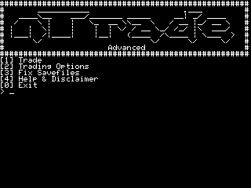

# nTrade Advanced

A program for the [Ti-Nspire](https://education.ti.com/en/us/products/calculators/graphing-calculators/ti-nspire-cx-cas-handheld/), which allows you to trade Pokemon between the third generation Pokemon games *(FireRed, LeafGreen, Ruby, Sapphire & Emerald)*

##Screenshots##

##Requirements
[Ndless](http://ndless.me/) is required.  
Currently nTrade Advanced confirmed to work on the following versions of Ndless
- [x] 3.1  
- [x] 3.6  
- [x] 3.9  
- [x] 4.0
- [ ] 4.2

##Usage
1. Copy your and your friend's savestate into ***/documents/1.sav*** and ***/documents/2.sav***
2. Start nTrade Advanced  
3. Select, which Pokemon you want to trade
4. Trade

##Other Functions
####Fixing savefiles  
>When a savefile gets corrupted (for example due to cheating), this might fix it for you.
>Here are some excellent links on how a .sav file is structured in the third generation
>* [Save Data Structure](http://bulbapedia.bulbagarden.net/wiki/Save_data_structure_in_Generation_III)
>* [Pokemon Data Structure](http://bulbapedia.bulbagarden.net/wiki/Pok%C3%A9mon_data_structure_in_Generation_III)  
>
>What the function does, is that it recalculates the checksum of each section, so the game believes, that the .sav file is valid (even if it's completely messed up). This lets you at least load the save file (and maybe rescue some Pokemon)
>**However** it does **not** recover corrupted Pokemon (so-called *Bad Eggs*) as each Pokemon has it's own checksum and I haven't yet figured out, how this one is getting calculated

##License
This sourcecode is licensed under the [MIT license](LICENSE)
